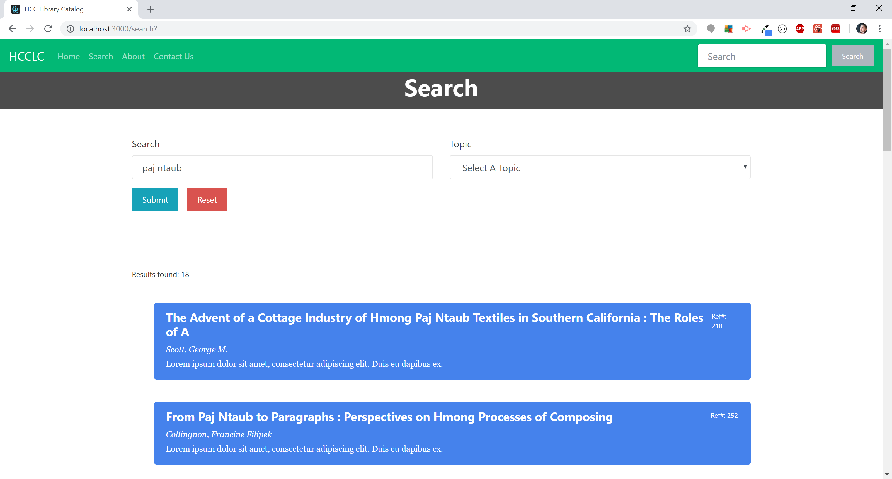

# Hmong Cultural Center's Library Catalog (IN-DEVELOPMENT)
The Hmong Cultural Center's Library Catalog is an online catalog that allows users to search the largest collection of Hmong-related theses and dissertations and journal articles of any institution in the United States. The web application also gives HCC the tools to update and maintain the growing collection.

## About
Hmong Cultural Center's collections include more than 700 Hmong-related books, 325 Hmong-related theses and dissertations, over 800 Hmong-related academic journal articles over 3,500 Hmong-related newspaper articles and 311 videos as well as 52 CDs and 32 DVDs. The library likely has the largest collection of Hmong-related theses and dissertations and journal articles of any institution in the United States. The collections also include extensive archives of issues of local Hmong newspapers dating back to the 1990s and Hmong-related articles from mainstream newspapers going back to the 1970s.

Library Personnel: Mark E. Pfeifer, PhD

## Demo
You can find the Hmong Cultural Center's Library Catalog deployed [here](#). (Coming soon...)





## Installation
```shell
$ git clone git@github.com:tsimnujhawj/hcclibrary.git
$ cd hcclibrary
yarn install || npm install
```
## Technologies/Tools
- Express
- MySQL
- React

## Development Notes
I have some major considerations before proceeding further with the project:
- dump the data into a noSQL (MongoDB)
- build the API design with the GraphQL architect as opposed to REST

## About Me
My name is Tsimnuj Hawj. I am a full-stack web developer with education from the University of Minnesota's Coding Bootcamp. I am also a current staff at the Hmong Cultural Center. This is a project initiated by myself to build a web database of the collection we have to better manage and oversee the extensive archive that the center has accrued over the years.
